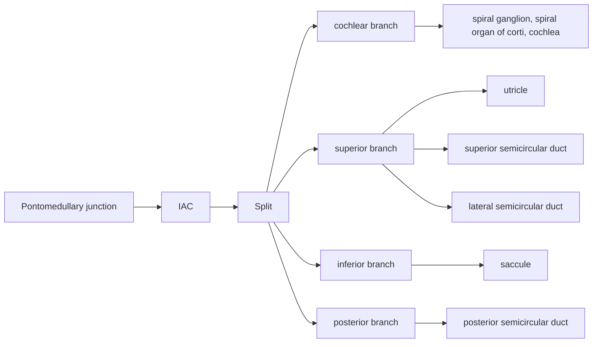

---
cssclasses:
  - iframe_wide
moc: "[[MOC Vestibular Schwannoma]]"
---
# Epi
- Overall incidence: ~1/100,000 person-years (in the millions)
- 8% of intracranial tumors. #pimp 
	- 90% of CP angle tumors #pimp 
- 3:1 M:F in the 70s, now 2.3:1 M:F 
- decreasing size at diagnosis from 3 cm (70s) → 1 cm (now) due to MRI
- Median age 50-55. Incidence increases with age.
- Up to 1% of the general population harbor subclinical VS. 
	- Compare to: 3% meningioma, 25% pituitary adenoma.
# Risk factors
| exposure                          | Risk                                                                |
| --------------------------------- | ------------------------------------------------------------------- |
| Acoustic trauma                   | OR 2.2 10+y vs. 13.1 for 20+y of exposure to extremely loud noise |
| Parathyroid adenoma               | OR 3.4.                                                           |
| Childhood exposure to low-dose RT | RR 1.14/Gy. (tinea capitis?)                                      |
- NF-2 (Ch 22): 
	- Schwannoma, meningioma, glioma, optic nerve glioma, neurofibroma, cataracts.
		- Bilateral acoustic neuromas are pathognomonic 
	- 10% of patients with acoustic neuroma, 
	- 96% of patients with NF-2 have ANs 
	- Merlin or schwannomin (involved in actin cytoskeleton organization).
	- genetics
		- Majority (90%) are sporadic. Biallelic inactivation of NF-2 (merlin TSG) is common in sporadic.
# Anatomy
		![[CN_anatomy.png#invert|600]]
![[coclear_anatomy.png#invert]]

- ANs occur with equal frequency in sup and inf vestibular branches, rarely the cochlear branch.
- Obersteiner-Redlich zone:
	- Origin site of most ANs.
	- Junction between central and peripheral myelin.
	- At the vestibular region of the foramen
# Pathology
- Antoni A and B are alternating zones of dense and sparse cellularity, respectively.
- Verocay bodies. Most stain for S100.
# Workup
## H&P:
- CN VIII: Balance, vestibular symptoms
- CN VIII: hearing changes (only ~66% aware, though 15% develop sudden hearing loss), tinnitus,
- CN V: Trigeminal symptoms, #pimp
- CN VII: facial nerve symptoms #pimp 
- Can have schwannomas of other nerves (Vagus, glossopharyngeal, etc.) #emph 
	- not sure why VIII forms them more commonly
- NF2 history.
	- NF2 testing if bilateral. 
- Ask the patient to tighten the anterior neck to test the platysma (innervated by CN VII, may be affected in larger lesions).
## Audiometry:
- tone, frequency (usually high frequency hearing loss) #pimp 
- [Rinne test](https://www.pinterest.com/pin/192669690295036942/): Mastoid. Air > bone conduction. With conductive hearing loss, bone > air conduction.
- [Weber test](https://www.pinterest.com/pin/192669690295036942/): Occiput. Vibratory sound louder on the good side with sensorineural hearing loss, while louder on the affected side for conductive loss (e.g., cerumen impaction). 
- brainstem auditory evoked response:
	- 60-90% Sn (lower for small tumors),
	- 60-90% Sp
## Imaging: 
- MRI gold standard.
	- Isointense or slightly hypointense T1, usually with homogeneous T1 contrast enhancement. Occasional cystic degeneration [DeLong Contemp NS '11](https://oce.ovid.com/article/00029679-201110310-00001/HTML).
	- Classic sign: "Ice cream cone" shape and widening of porus acusticus [Schmalbrock AJNR '99](http://www.ajnr.org/content/20/7/1207.long).
	- High resolution 3D T2 weighted sequences (e.g., CISS or FIESTA) may improve visualization of cisternal segments of lower cranial nerves and its relation to tumor [Combs RTO '20](https://pubmed.ncbi.nlm.nih.gov/33309848/).
	- Ddx: #pimp  
		- VS, meningioma, glomus tumor, ependymoma, facial or trigeminal schwannoma, epidermoid cyst, metastasis. 
- High-res CT if MRI unavailable
## No biopsy needed.
## scales/scores
- House-Brackmann facial paralysis scale: #pimp 

| stage | description                                                           |
| ----- | --------------------------------------------------------------------- |
| I:    | Normal                                                                |
| II:   | mild                                                                  |
| III:  | normal symmetry at rest                                               |
| IV:   | asymmetry at rest, incomplete eye closure, moderate forehead movement |
| V:    | barely perceptive motion                                              |
| VI:   | total paralysis                                                       |

- Gardner-Robertson hearing scale: #pimp 

| Grade                  | I    | II          | III             | IV   | V    |
| ---------------------- | ---- | ----------- | --------------- | ---- | ---- |
| Discrimination (%)     | 70   | 50          | 5               | 1    | 0    |
| Pure tone average (db) | 0-30 | 30-50       | 50-90           | 91+  | NA   |
|                        | Good | Serviceable | Non-serviceable | Poor | Deaf |

# Prognostic factors

- Baseline hearing loss, growth rate >2.5mm/y (hearing preservation 75→ 32% [Sughrue JNS '10](https://thejns.org/view/journals/j-neurosurg/112/1/article-p163.xml), median time to total hearing loss 14.8→ 7y [Sughrue JNS '11](https://thejns.org/view/journals/j-neurosurg/114/2/article-p381.xml)) --> delay in diagnosis. Initial tumor size is not prognostic.

- Growth per year: #pimp 

 | %   | annual growth                           |
 | --- | --------------------------------------- |
 | 90% | < 3 mm                                  |
 | ----50% | < 1 mm,  ~20-40% are considered stable. |
 | ----40% | 1-3 mm                                  |
 | 10% | > 3 mm                                  |

- Meta [Smouha Laryngoscope '09](https://onlinelibrary.wiley.com/doi/full/10.1097/01.mlg.0000175681.52517.cf): 3.2y MFU with ~40% PD, ~50% SD, 6% spontaneous regression.
- Koos grade [JNS '99](https://thejns.org/view/journals/j-neurosurg/88/3/article-p506.xml)

 | Grade | Description                                                                |
 | ----- | -------------------------------------------------------------------------- |
 | I:    | < 1 cm, IAC.                                                               |
 | II:   | 1-2 cm IAC, or   outside canal (extending into posterior fossa) < 1 cm. |
 | III:  | < 3 cm, abutment of stem.                                                  |
 | IV:   | > 3 cm, displacement of stem/midline shift.                                |

# Treatment options
## Observation
- Small, slow-growing, asymptomatic tumors
- [[Brevik (obs v SRS)]]: Norwegian study. SRS has better hearing preservation.
- go for treatment if progression on House-Brackman, Gardner-Robertson 
## [Surgery](https://docs.google.com/document/d/17O0LOemBhckXGuuPBCh6u8vqBfc6lg88r46B8YctMXU/edit#heading=h.24k8o3ev6hbp)
- Complications: CSF leak #pimp, damage to adjacent CN VII. Hearing preservation is around 20-50%, though hearing preservation is more likely when the tumor is < 1.5-2 cm in size. Higher rates of facial (7% [Samii NS '97](https://www.ncbi.nlm.nih.gov/pubmed/9092841)) and trigeminal neuropathy versus RT.
- can do subtotal resection if facial nerve is at risk #emph
	- postop options: observe vs RT based on patient PS #pimp 
- Most common treatment, especially for younger patients,
- Strong indications: rapid growth rate, large (>4 cm) symptomatic tumors or recurrence/progression after RT. #pimp  
- Recurrence after GTR is only 1%! [Gormley NS '97](https://www.ncbi.nlm.nih.gov/pubmed/9218295)
- LR for STR RR 9. Nodular enhancement on initial post-op MRI with 16x risk of recurrence compared to linear pattern [Mayo, Carlson Laryngoscope '12](https://onlinelibrary.wiley.com/doi/full/10.1002/lary.22411)
![[VS_surgery.png#invert]]
- Microsurgery: Translabyrinthine, middle cranial fossa approach or suboccipital/retrosigmoid approach. #pimp 

| Approach | Pros | Cons |
| ---- | ---- | ---- |
| Middle cranial fossa | GTR common, as exposes lateral third of IAC but not posterior fossa, moderate facial nn preservation.   For < 1.5 cm with hearing preservation as goal. | Limited access to PF, requires temporal retraction and facial nn more vulnerable to injury. Dural lacerations are common in older pts which may cause trismus from temporalis muscle injury. |
| Translabyrinthine | Excellent visualization of anterior brainstem and facial nn (facial nn preservation).   Does not require CBL manipulation.   For > 3 cm. | Sacrifices hearing. #Pimp Not a great view of posterior fossa (compared to retrosigmoid), some tumors may be difficult to access. Fat graft required, sigmoid sinus more prone to injury. |
| Retrosigmoid/ suboccipital | Possible hearing conservation, good facial nn preservation. Best visualization of posterior fossa, but not of lateral third of IAC.   Any size. | May not get GTR, poor visual of lateral IAC.   Requires CBL retraction and intradural drilling of IAC, therefore increased risk of CSF leaks and headaches. |

- Hearing preservation at like 50% for hearing-preservation surgery (optimistic)
- surgery vs RT
	- RT: fewer complications, but no path
	- Surgery: more complications, but may work better for larger tumors.

![[ECRO_acoustic-neuroma.pdf]]