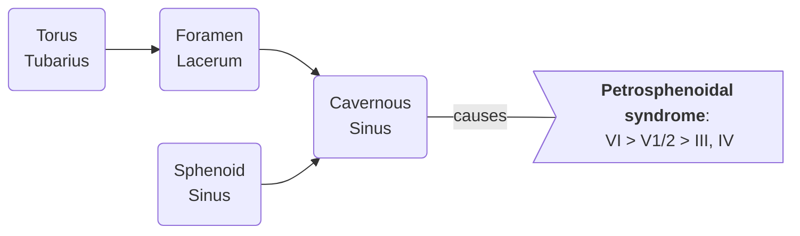
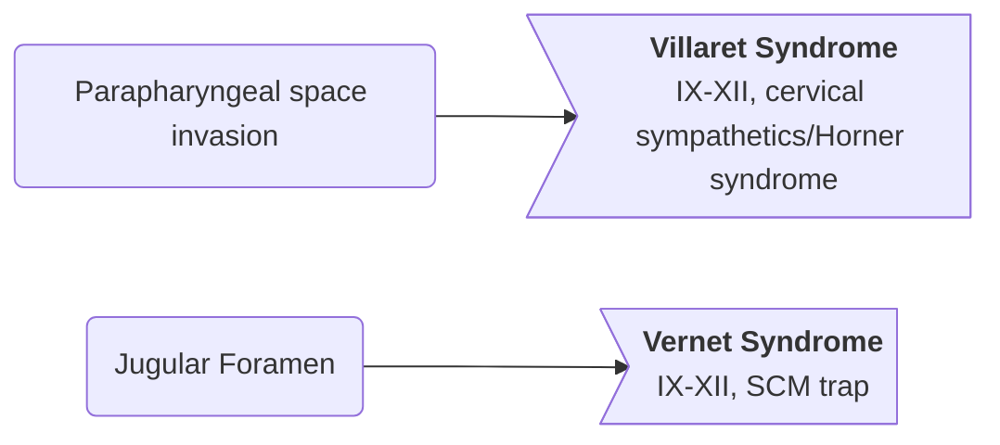
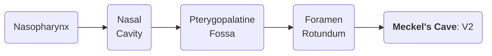

# Epi
- USA: 3,200 cases per year: < 1 in 100,000 in USA
- World: 90k cases per year: 25-50 in 100,000 in SE Asia.
	- with over 50k deaths (about half in China)
	- Most common H&N cancer and #6 in deaths in SE Asia.
- 2.3:1 M:F.
- Bimodal, with peak 15-25 and 50-60. Median age 50.

# Risk Factors
- EBV, consumption of salted fish and preserved meats (dimethylnitrosamine), Wood and leather dust exposure (AC), nickel workers, thorotrast exposure, male gender, smoking (KSqCC), dermatomyositis.
- Alcohol is _not_ a risk factor.

# Anatomy
![[img_ECRO_Nasopharynx_anatomy1.png]]
![[img_ECRO_Nasopharynx_anatomy2.png#invert]]

## Nasopharynx Borders
|           | Borders #pimp                                                                      |
| --------- | --------------------------------------------------------------------------- |
| Superior  | Sphenoid sinus/clivus                                |
| Inferior  | Roof of the soft palate                                                    |
| Anterior  | nasal choanae                                                    |
| Posterior | clivus, C1, C2                                              |
| Lateral   | torus tubarius, fossa of Rosenmuller |

- Torus tubarius:
	- cartilaginous prominence in the lateral wall of nasopharynx that forms the opening of the Eustachian tube.
- Fossa of Rosenmuller:
	- located posterior to torus tubarius and is the most common location of NPC.
- pharyngobasilar fascia #emph
	- there is a weakness at the skull base and at the sinus of Morgagni
	- leads to easy site of invasion for disease.
- axial anatomy #pimp
	- PPF, Fossa of Rosemuller, EAC, Torus, medial pterygoid, IC, IJ, etc.
	- Spaces:
		- carotid sheath/retrostyloid space
		- parapharyngeal space
		- infratemporal fossa/masticator space
			- invasion -> trismus
		- retropharyngeal space

## Syndromes
### Petrosphenoidal Syndrome (_Jacod_)

- blindness, opthalmoplegia, TG neuralgia
- NPC is likely to go through the lacerum. True intracranial extension < 10%.
- CN VI has the longest course throughout the subarachnoid space ∴ most vulnerable to injury following cavernous sinus and/or clival involvement.

### Retroparotid Space Syndrome (_Villaret_ and _Vernet_)

- #pimp shows a picture of sholder drop, lid drop, etc.
### Meckel's Cave Syndrome

## Regional/Distant Disease
- nodal staging is the same as in [[ECRO Oropharynx#HPV+]]
	- RPs can be b/l and still N1.
- cN+: 60-90%. up to 50% bilateral.
- Nasopharynx LN spread: 90% occult!!! The highest risk of nodes in all H&N cancers.
- High retropharyngeal, ± IB, II-V, posterior ⅓ of the maxillary sinus, lat mandibular ramus, back of OP.
	- Adenopathy near the mastoid tip suggests RP involvement (**node of Rouviere**).
	- Upper-level V LAD is most likely NPC primary.
- these have a more posterior drainage than OPx, OC, Lx #emph
- IB only at risk if lots of anterior extension to NC or backflow with lots of nodal disease #emph
- DM reported in 5-10% on presentation.
	- RF for DM: Lower neck nodal, advanced stage, Nonkeratinizing undifferentiated (WHO II/III) histology.

# Staging
![[img_ECRO_Nasopharynx_staging.png#invert]]

## Changes from 7e
- medial/lateral PT muscles = T2 (not T4)
	- because of the thinning at the sinus of Morgagni means even small tumors can invade #emph
## N Staging
- similar to [[ECRO Oropharynx#HPV+]]
- multiple nodes != N2 automatically.
	- relative indication for adding chemo postop (make sure you look closely)

# Histology
(US incidence / endemic incidence)

| WHO      | incidence (US / Endemic)                     |                                                                                                                     |
| -------- | -------------------------------------------- | ------------------------------------------------------------------------------------------------------------------- |
| I        | KSqCC: (25% / 1%)                            | Sporadic. Keratinizing, tobacco, poor LRC. Most common type in US. Poor prognostic factor.                 |
| II       | NKSqCC/transitional cell: (12% / 3%)         | May be EBV related.                                                                                                 |
| III      | NKUD/lymphoepithelial carcinoma: (60% / 95%) | EBV associated.  Endemic to SEAsia and E Asia (95%).  High lymphoid component. Better LRC, worse DM = same OS |
| Basaloid | (< 0.2 % endemic)                            | Aggressive course, poor survival                                                                                    |
- _Note_: incidence of EBV associated disease is higher in US than non-EBV (though not to the same degree as worldwide)
	- this provides the rationale for induction chemo per [[CICT]]

# Workup
## History
- focus on neck mass (> 60%), nasal symptoms (30%) epistaxis, CN palsy, trismus, otalgia, diet (smoked/salted meats).

## Physical
- 60-90% have palpable LAD, up to 50% have bilateral LAD. RPs can be b/l and still N1.

## Labs
- EBV IgA/DNA titers!
	- still investigational, but lots of promising data
	- can help make treatment decisions (especially to monitor response to treatment/recurrence)
- LDH, CBC, CMP.

## Imaging
- MRI: include BOS or CT BOS/neck
- For stage III/IV: consider {CT C/A + bone scan} or {PET/CT}.

# Treatment
## Principles
- based on EBV data, so for EBV-, treatment is extrapolated
- no role for surgery #emph
	- not even for the smallest nicest T1N0
	- no good salvage options, so threshold to intensify (i.e. add chemo) is very low (see [[Tang (LR Deescalation)]])
- always need to treat the elective neck
- most of the decision-making is whether (T2N0) and when (everything else) to use chemo

## Induction
- if EBV+: RLD uses iChemo per [[CICT (CCRT ±iChemo)]]
- if EBV-: RLD uses CCRT+aChemo
- Concern that if induction goes poorly, you burn your bridge for concurrent chemo (which is way more important)
	- pay attention to % completing assigned therapy in the trials

## Metastatic
- compare to the NCCN "Very advanced" ADV-2
	- basically just palliative RT
- NPx is different (see [[SYSUCC5010 (mNPx, RT to primary)]])
- NPx OligoM: straight to CCRT
- NPx PolyM: systemic therapy -> if good response -> give definitive RT

## RT
- 93% dose to 99% of PTV_70 #pimp
- 100% dose to 95% of PTV_70

![[ECRO_nasopharynx.pdf]]