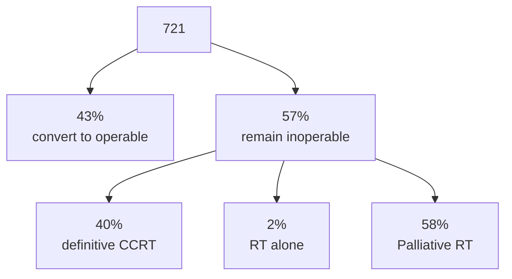

[moc::"[[MOC Oral Cavity]]"]
>[!title]
> Tata memorial [Patil Oral Onc '14](https://www.sciencedirect.com/science/article/pii/S1368837514002255?via%3Dihub): Retro. 

>[!intervention] 
> induction TPF -> Surgery vs. Non-surgical (CCRT or palliative RT alone).

# study
- 721 pts. 
	- Stage IV OC 
	- 80% betel nut users. 
	- 70% buccal mucosa.
	- T4a ~75%. T4b ~25%. 
	- N2b+ 75%.
	- 2008-2012. 
- Induction chemo
	- Typically TPF, but carboplatin may be substituted for CDDP, and 90% omitted 5-FU.
	- 85% of patients completed 2 cycles.
- RT
	- POCCRT to 66 Gy, CCRT 70 Gy w cisplatin 30 qweek.
	- Palliative RT at 40/16 or 30/10.

# results
 
 | results                      | 3 drugs | 2 drugs (docetax) | 2 drugs (paclitax) |
 | ---------------------------- | ------- | -------------------- | --------------------- |
 | Overall response             | 50      | 30                   | 17                    |
 | Achievement of resectability | 66      | 40                   | 40                    |

---

---
| 2y  | Operable | Inoperable |
| --- | -------- | ---------- |
| LRC | 32       | 15         |
| MS  | 20m      | 8m         |

Non-surgical treatment most commonly palliative RT, not CCRT.

>[!summary] 
> How should Locally Advanced/inoperable cases be handled? 
> - Patil at Tata Memorial gives us an approach involving induction chemo. 
> - 721 patients with inoperable, stage IV disease were treated with 2c of induction TPF. 43% converted to operable. The remaining underwent either definitive CCRT or, more likely palliative RT. 
> - If you look at the subset who completed 2 cycles of the full 3 drug regimen, 66% achieved resectability which was important because the LRC was doubled and the MS was tripled with surgery. 
>^summary

![[05_Patil.pdf]]

**