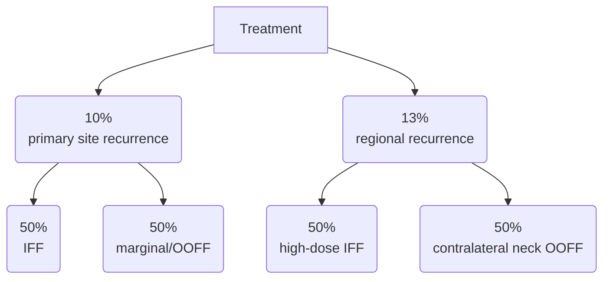

[moc::"[[MOC Oral Cavity]]"]
>[!title]
> UK Evaluation of LRR Patterns [Waldram Clin Onc '19](https://www.ncbi.nlm.nih.gov/pubmed/31668378): Retro. 

>[!intervention] 
> Surgery and PO-IMRT ± concurrent chemo.

# study
- 101 pts. 
	- OC SqCC. 
		- Half oral tongue. 
		- 2013-2016. 
		- MFU 2.5y.
- RT:
	- 60/30 (bed + dissected nodes), 
	- 66/33 (< 1 mm margins, ECE or soft tissue deposits), 
	- 54-56/30-33 ENI.
		- nearly half had ipsilateral neck RT alone

# results
- 3y LC / LRC / OS of 88→ 85→ 63%.
- MTTR 6 mo (0-28 mo).

| high-dose IFF | high-dose marg. | elective IFF | elective marg. | OOFF |
|:-------------:|:---------------:|:------------:|:--------------:|:----:|
|      42       |       17        |      8       |       8        |  25  |

- Oral tongue cancer patients with untreated/dissected contralateral neck had 24% (n=5/21) contralateral neck failure.
- Only 50% of patients with a neck recurrence underwent salvage neck dissection. All failed or developed DM.

>[!summary] 
> Where do these patients fail?
> - the UK Patterns of Failure study looked at 100 patients who underwent surgery and postop RT, with or without concurrent chemo. RT was fairly modern via IMRT with 3 dose levels. 
> - The results showed that half failed in the high-dose region and half were marginal misses or OOF. 25% of those with unaddressed contralateral neck failed with a 0% successful salvage rate (consistent with [[Ganly (iLND+pGlos, no RT)|Ganly]]).  
> - Be generous with your coverage and low threshold for bilateral neck treatment. 
>^summary

![[07_UK-POF.pdf]]