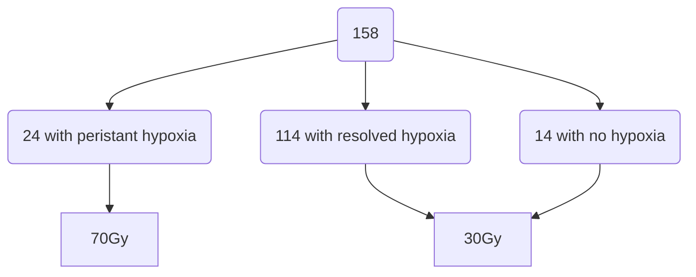

[moc::"[[MOC Oropharynx - HPVpos]]"]
>[!title]
> ROC [Riaz JNCI '20](https://academic.oup.com/jnci/advance-article/doi/10.1093/jnci/djaa184/6080244), [Lee ASCO '21](https://meetinglibrary.asco.org/record/196374/abstract):

>[!intervention] 
> Primary tumor resection→ POCCRT 60 vs. 30 Gy (LND at 4 mo).

# Study
- inclusion:
	- P16+ 
	- OP, 
	- T0-2N1-N2cM0 by AJCC 7th ed.
- FMISO PET was used to identify hypoxia in gross nodal disease.
	- Patients with evidence of hypoxia (> 1.2 tumor to muscle SUV on F-MISO) underwent repeat F-MISO around 2w into RT.
	- Patients with pre-RT hypoxia or with resolution of hypoxia received 30 Gy with CDDP 100 x2c or Carboplatin AUC 1.25 x4c with 5-FU 2.4g/m2.  
	- ![[img_30-ROC_protocol.png]]

## Pilot Study
- 19 pts
	- 15 were candidates for de-escalation (negative pre or intra-tx FMISO).

## Larger Validation Study
- 158 patients
	- Enrolled 2017-2021.
	- MFU 1y.

### Treatment

# Results

| 2y    | 30  | 70  |
| ----- | --- | --- |
| LRC   | 95  | -   |
| PFS   | 94  | 96  |
| OS    | 100 | 96  |
| aG3/4 | 32  | 58  |
| lG3/4 | 0   | 5   |

- 30Gy: 
	- 0 primary site failures 
	- 8 nodal failures 
		- 100% successful salvage dissection of which no additional therapy was given to 4 patients.
	- 1 distant failure

# Notes
- can use charged particles to overcome OER problems
- smokers have a much greater risk of hypoxia (meshes well with [[RTOG 0129 + RTOG 0522#notes|RTOG 0129]] risk group findings that smokers are at higher risk)
- apparently MSKCC is using 30Gy as their standard ENI dose (because they would be normoxic)
	- RLD is close to dropping down to 30 Gy (cited a Belgian trial for HPV- dose-deescalating down to 40 Gy ENI)
- We're trying to do a version of this with FDG-PET response in the definitive setting
- surprisingly high toxicity in the 30 Gy

>[!summary] 
> Maybe we can use PET to help us pick which patients may be best suited for dose-reduction?
> - 30-ROC is a fascinating study which was able to effectively dose-reduce all the way down to 30 Gy.
> - The idea was that hypoxic tumors are inherently radioresistant and so dose-reduction would be a very bad idea in those patients. They used an F-MISO PET screen out those patients, leaving a radiosensitive cohort who got only 30 Gy. Only 20% of the 160 patients had problematic hypoxia requiring the full RT dose. 
> - this is still investigational, but even out to 2 years, LRC is excellent at 95% and there were no deaths. 
>^summary

# Pdf
![[07_30-ROC.pdf]]
