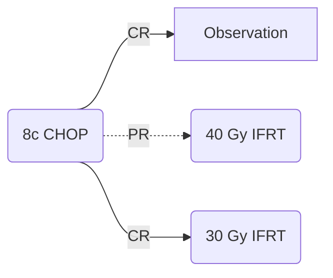

[moc::"[[]]"]
>[!title]
> ECOG 1484 [Horning JCO '04](http://ascopubs.org/doi/abs/10.1200/JCO.2004.06.088?url_ver=Z39.88-2003&rfr_id=ori:rid:crossref.org&rfr_dat=cr_pub%3dpubmed):

>[!intervention]
> 8c CHOP ± IFRT 30 Gy with CR (40 Gy for all if PR).

# Study
## 352 Pts
- 66% stage II.
	- Less favorable disease than [[SWOG 8736 (CHOP ± RT)]]
- 50% extranodal
- 31% >10 cm
	- More pts in RT arm had bulky disease (7→ 26%)
- 80% DLBCL
- MFU 12y

## Treatment

# Results
## Response
- CR in ~70% 
- In the PR (40Gy) subgroup: only 28% achieved CR after RT
## Control
### CR
| 6y  | CHOP | +RT    |
| --- | ---- | ------ |
| DFS | 56   | ==73== |
| OS  | =    | =      |
| LR  | 48   | ==17== |
| DR  | 82   | ==52== |

### PR
- 6y FFS 63%

>[!summary]
> - Relapse less likely at original site with RT, along with less distant metastases. Although this study did not demonstrate an OS benefit (like short term follow up in SWOG above), PFS may be a surrogate for OS [Shi JCO '18](https://www.ncbi.nlm.nih.gov/pubmed/29975624). 
> - Around half will relapse "in the neighborhood" with chemotherapy alone.
>^summary
