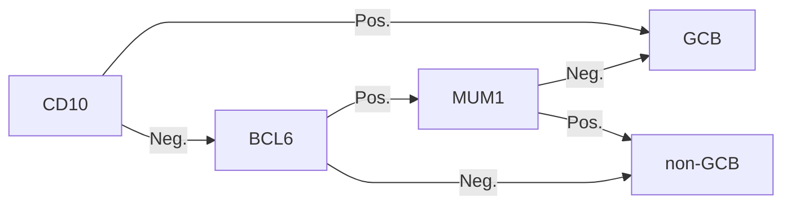

# See [[ECRO Indolent NHL]]

# Epidemiology
- 50-60% are aggressive

# Histologies
#pimp 
- move NKT cell paper to aggressive #todo 
## Burkitts
- 4:1 M:F.
- t(8;14)
	- b-myc→ IgH
	- C-MYC
## DLBCL
- t(14:18): BCL2, BCL6, ALK, etc.
- know immunotypes #pimp 
### Epidemiology
- MC NHL
	- 33% of NHL 
- Only 30-40% present as stage I-II.
- Extranodal disease is common.

### Subtypes

#### Primary Mediastinal B-Cell Lymphoma
- Great prognosis.
- Check PDL1 mutation to differentiate if secondary (+ = PMBCL).

#### Germinal Center B-Cell Lymphoma
- Great prognosis. 5y OS 64%.
- CD10+ or BCL6+, MUM1-.

#### Anaplastic B-Cell Lymphoma
- Poor prognosis. 5y OS 34%.
- Older Males.
- Activation of NFκB.  CD10-, BCL6or BCL6+, MUM1+.

### Genetics
#### MUM1
- Lymphocyte-specific transcriptional factor
- interferon regulatory factor (IRF) family
	- regulation of gene expression in response to interferons and other cytokines

#### Double Hit
- assessed via FISH
- **breaks** at MYC + (BCL-2 or BCL-6)
	- "_triple hit_" if both
- 2-12% of DLBCL
- → higher proliferative index, poor outcomes

#### Double Expressor
- assessed via IHC
- **Overexpression** of myc + bcl-2.
	- Requires FISH for double hit confirmation

# Prognosis

| IPI APLES | 5y OS* | NCCN-IPI APLES | 5y OS | FLIPI NoLASH | 5y OS | [[FLIPI-2]] β-MASH | 5y OS |
| ------------ | ------ | ----------------- | ----- | --------------- | ----- | --------------------- | ----- |
| 0-1          | 75%    | 0-1               | 95%   | 0-1             | 90%   | 0                     | 98%   |
| 2            | 50%    | 2-3               | 80%   | 2               | 80%   | 1-2                   | 88%   |
| 3            | 40%    |                   |       | 3-5             | 55%   | 3-5                   | 77%   |
| 4-5          | 25%    | 4-5               | 65%   |                 |       |                       |       |
|              |        | 6+                | 33%   |                 |       |                       |       |
*Add ~20% to 75/50/25 above for the addition of Rituximab (R-IPI).

## IPI
- Only for intermediate and high grade NHL.
- compare to [[FLIPI-2]]
	- includes Hgb < 12 (as opposed to < 10.5)
	- includes β2 microglobulin
- IPI remains prognostic but does not account for genetics 
- [NEJM '93](https://www.nejm.org/doi/10.1056/NEJM199309303291402?url_ver=Z39.88-2003&rfr_id=ori:rid:crossref.org&rfr_dat=cr_pub%3dwww.ncbi.nlm.nih.gov):
	- "APLES"
		- **A**ge > 60,
		- **P**S (ECOG) > 1,
		- **L**DH > ULN,
		- **E**xtranodal group >1,
		- **S**tages III-IV
	- endpoint: 5y-OS
	- 1,274 pts with Aggressive nodal NHL, Stage I-II.

## R-IPI
- NCCN R-IPI: [Zhou Blood '14](http://www.bloodjournal.org/content/123/6/837.long)
	- "APLES"{points}: compare to [[#IPI]]
		- Age > {40:1, 60:2, 75:3}
		- ECOG PS ≥ {2:1}
		- LDH {1-3:1, {>3:2}
		- Extranodal site {1}
		- Stages III-IV {1}
	- 1,650 pts treated in the Rituxan era. 
# workup
- labs
	- hepatitis testing
		- complications with Rituximab
- Imaging
	- PET
		- Deauville #pimp 
	- prefer palpation over surveillance scans after remission #emph 
		- BUT re-staging PET at 8-12 months is a good idea #pimp 
- Biopsy
	- Core is fine, excisional is fine
# staging
- drop the A, B, E, X
- but, include largest diameter in the one-liner (required)
# Treatment
- No surgery (excisional biopsy, only)
- give chemo (RCHOP)
	- 30 Gy for CR
	- 36 Gy for CR with bulk
	- 40+ Gy for PR
- 50+ Gy for definitive

![[ECRO_aggressiveNHL.pdf]]