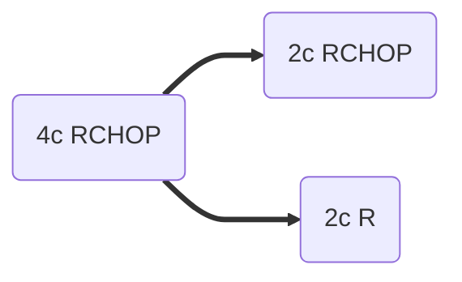

[moc::"[[]]"]
>[!title]
> FLYER (2005-2016) [Poeschel Lancet '19](https://www.thelancet.com/journals/lancet/article/PIIS0140-6736(19)33008-9/fulltext): 

>[!intervention] 
> R-CHOP x4c→ (R-CHOP vs. Rituximab) x2c.

# study
## 592 patients
- favorable LS-DLBCL 
- 18-60y. 
- Age adjusted IPI (PS, LDH, stage) score 0. 
- Non-bulky (< 7.5 cm). 
- Extralymphatic (32%). 
- No RT unless testicular involvement. 
- MFU 5.5y.

## Treatment

# results
- 3y PFS ~95%.

>[!summary] 
> This trial established R-CHOP x4c→ Rituximab x 2c (over 6c of R-CHOP) to be standard for younger patients with low risk LS-DLBCL.
>^summary
