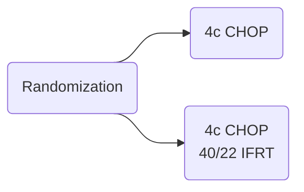

[moc::"[[]]"]
>[!title]
> GELA 93-4 (Elderly) [Bonnet JCO '07](http://ascopubs.org/doi/abs/10.1200/JCO.2006.07.0722?url_ver=Z39.88-2003&rfr_id=ori:rid:crossref.org&rfr_dat=cr_pub%3dpubmed):

>[!intervention]
> 4c CHOP {± 40 Gy IFRT}

# Study
## 576 Pts
- age > 60y,
- stage I-II,
- IPI 0 NHL.
- DLBCL (80%).
- MFU 7y.

## Treatment

- Delays to RT: Only half of patients started before week 7.

# Results
- ~90% response.

## Survival (equivalent)
- 5y EFS ~63%
	- Lower EFS than other studies.
- 5y OS ~70%.

## Control (favors RT)
- Any relapse 29→ 22%.
- local relapse 18→ 7%.
- distant metastasis 15→ 17%.

>[!summary]
> There is no EFS benefit with the addition of RT to CHOP chemotherapy, although LR cut in half with RT. 
More DM in RT arm likely due to increased local control. Rituxan likely would have cut down on DM.
RT started > 5 weeks after completion of chemo in over half of patients. 12% on RT arm did not receive it. 
In field recurrence was 7%, indicating possible poor RT quality given 0% IFF on [SWOG 8736](https://docs.google.com/document/d/1gKy2Hpx7FxInjOpKIBkTFJWpqhJ3I-gSXz9eRwq-NSY/edit#bookmark=id.q7zy3uortpgx), [Lysa-Goelems](https://docs.google.com/document/d/1gKy2Hpx7FxInjOpKIBkTFJWpqhJ3I-gSXz9eRwq-NSY/edit#bookmark=id.ptyy03dwjkpi).
This elderly group had an age-adjusted IPI of 0 and normal LDH, a very homogeneous and low risk population.
This trial was stopped early due to no difference in EFS with IFRT, along with the release of Rituxan.�
>^summary
