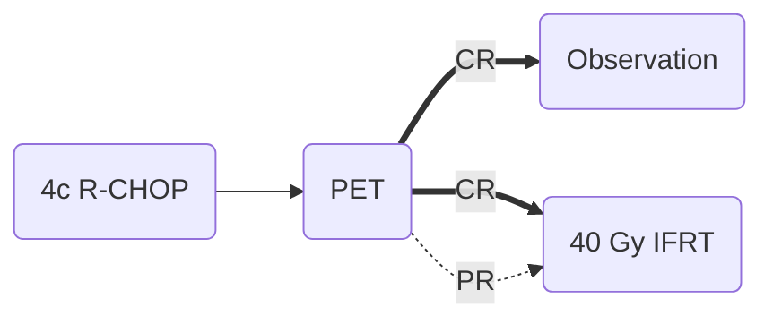

[moc::"[[]]"]
>[!title]
> Lysa/Goelams 02-03 [Lamy Blood '18](http://www.bloodjournal.org/content/131/2/174):

>[!intervention]
> R-CHOP x4-6c {± 40 Gy IFRT}. PET0, PET4, and EOT.

# Study
## 301 Pts
- Non-bulky (< 7 cm)
- 40% extranodal
- LS-DLBCL
- Mostly IPI 1-2
- MFU 5y
- Primary endpoint DFS.

## Treatment

- Chemo:
	- Two additional cycles given for 1+ stage adjusted IPI factor or PET4 PR (regression > 50% but persistent positive PET)
- PET4 negative:
	- Pre-Deauville era, but essentially D1-2.
	- D3+ considered positive.
- Unfavorable-risk: any of
	- age > 60y, elevated LDH, Ann Arbor stage II, ECOG >0, or mIPI ≥ 1

# Results
## Response
- CR 88%, PR 12% → Overall response: ~95%

## Survival
- 5y EFS ~89→ 92% (p=0.18).
- 5y OS ~92→ 96%
- PET4 PR RT patients achieved similar results to PET4 CR
	- suggests role of RT following only PR to chemo

## Control
- Any relapse ~5%.
	- MTT relapse 21 mo.
- LF:
	- In the RT arm, there were no relapses in the initial tumor site (n=10).
	- In the R-CHOP alone arm, 5/13 relapses were in the original sites of disease. D
	- ue to the low event rate, the impact of this improvement with RT did not translate to an improvement in EFS in this modest sized cohort.

## Toxicity
- Severe acute toxicities were less common from RT than R-CHOP.

>[!summary]
> Seriously, 40 Gy RT? IFRT??
Balancing the Therapeutic Ratio in DLBCL [Campbell IJROBP '22](https://pubmed.ncbi.nlm.nih.gov/35777387/): "Given the study design, it can only be concluded that in this highly selected, favorable-risk cohort, the additional benefit seen from consolidation RT on local control did not translate into >8% absolute benefit in 5-year EFS."
R-CHOP alone is non-inferior to R-CHOP + RT in very favorable, non-bulky LS-DLBCL with D1-2 on PET4. However, to say these arms are equivalent is misleading as all patients with PET4 regression > 50% but persistent positive PET or IPI of 1 or more received IFRT, which highlights the ongoing need for risk-adapted CMT [Imber and Yahalom Cancer J '20](https://pubmed.ncbi.nlm.nih.gov/32496455/).
It is already known that low risk patients do very well. Would RT have benefitted higher risk patients?
RT was given for all PET4 PR regardless of randomization.
There were no in field failures on the RT arm, while around half of failures were local in the chemo-alone arm.
See [SWOG 8736](https://docs.google.com/document/d/1gKy2Hpx7FxInjOpKIBkTFJWpqhJ3I-gSXz9eRwq-NSY/edit#bookmark=id.q7zy3uortpgx) for the role of RT prior to the pre-Rituximab era. Recall: Superiority of RT washed out at 7y on that study, so more follow up is needed on Lysa/Goelams to determine if omission of RT is reasonable in this very low risk population.
>^summary
