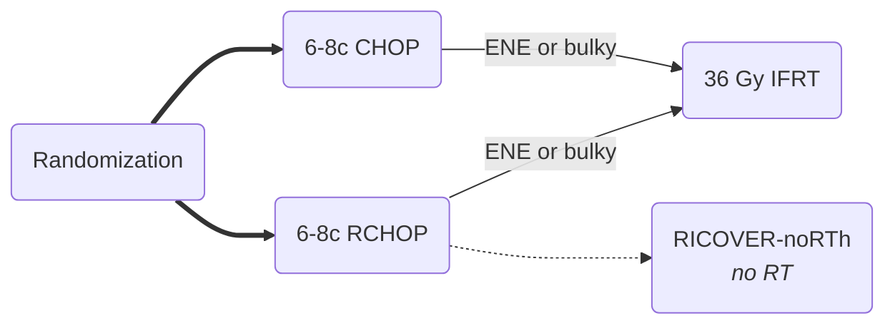

[moc::"[[]]"]
>[!title]
> RICOVER-60 [Pfreundschuh Lanc Onc '08](https://www.sciencedirect.com/science/article/pii/S1470204508700020?via%3Dihub):

>[!intervention]
> - CHOP-14 x6 vs. 8c ± R. Gave 36 Gy if bulky ( > 7.5 cm) or extralymphatic.

# Study
## 1,222 Pts
- Older (61-80y)
- any stage or IPI
	- Stage III/IV (51%).
- > 7.5 cm bulk (38%)

## Treatment

# Results
## Response
- CR: 76%
- Bulky CR: 60%

## Survival
- 3y EFS 47→ 66%
- 3y OS 68→ 78%
- No benefit with more than 6c of chemo
	- even for only PR after 4c

# TJQ
- pay attention to the bulky group. see [[FLYER (RCHOP + adj RCHOP v R)]]
- 

>[!summary]
> - In elderly early-stage NHL, R-CHOP is superior to CHOP.
> - There is no benefit to more than 6 cycles. 
> - see [[RICOVER-noRTh (RCHOP ± bulky RT)]] for no-RT results
>^summary
