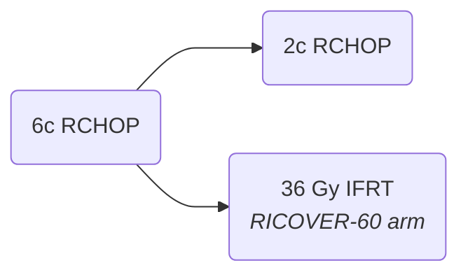

[moc::"[[]]"]
>[!title]
> RICOVER-noRTh [Held JCO '14](https://ascopubs.org/doi/full/10.1200/JCO.2013.51.4505):

>[!intervention] 
> R-CHOP-14 x6c (winning arm from {RICOVER-60 (CHOP ± R)}) {± 36 Gy} to bulky (not all sites).

# study
## 164 patients
- basically same as [[RICOVER-60 (CHOP ± R)]]

## Treatment

- Tried to avoid RT to bulky disease using the best chemo arm of RICOVER-60. 
	- 23% of patients with bulky disease received unplanned RT in RICOVER-noRTh arm.
- Best arm: 6 cycles of R-CHOP-14 with 2 cycles of adjuvant rituximab.

# results
- Bulky ITT analysis of CR-uCR 
	- relapse: 22→ 4%
- Post-hoc bulky CR-uCR subgroup: 
	- 3y EFS ~75→ 84% (p=0.43) 
	- 3y OS ~79→ 87% (p=0.84)
- Post-hoc PP bulky subgroup: 
	- 3y EFS 54→ 80% 
	- 3y PFS 62→ 88%
	- 3y OS 65→ 90%

>[!summary] 
> - Tried to omit RT from bulky disease, but failed!
> - Conclusion: Rituximab adds OS benefit to CHOP; per protocol RT to bulky disease adds OS benefit.
> - However, the benefit for bulky disease in CR is unclear
>^summary
