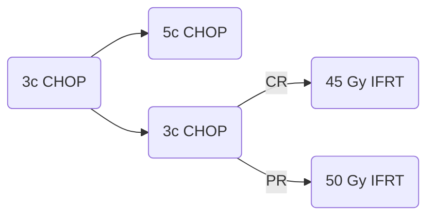

[moc::"[[]]"]
>[!title]
> SWOG 8736 [Miller NEJM '98](https://www.nejm.org/doi/10.1056/NEJM199807023390104?url_ver=Z39.88-2003&rfr_id=ori:rid:crossref.org&rfr_dat=cr_pub%3dwww.ncbi.nlm.nih.gov), [Stephens JCO '16](https://www.ncbi.nlm.nih.gov/pmc/articles/PMC5012710/):

>[!intervention]
> {8c CHOP alone} vs {3c CHOP + IFRT 45-50 Gy}

# Study
## 401 Pts
- Stage I
	- more favorable than [[ECOG 1484 (CHOP ± RT)]]
- bulky or non-bulky (66%),
- DLBCL (75%). 
- MFU 18y.

## Treatment

# Results
| results | CHOP | +RT |
| ------- | ---- | --- |
| 5y OS   | 72   | 82  |
| 5y PFS  | 64   | 77  |
| 7y PFS  | =    | =   |
| 15y PFS | 40   | 40  |

- Post-hoc: IPI 0-1 did well with RT.
- Excessive late OOF failures occur in the CHOP x3c / IFRT arm.
- CHOP had more heart failure and inability to complete treatment.

>[!summary]
> - Adding RT to chemo improves PFS and OS compared to chemo alone at 5y, although OS benefit is lost at long-term F/U. This was the first study to demonstrate an OS benefit with chemo plus radiotherapy.
>- At about 7y, the curves cross and become NS. Most failures were outside the RT field. Does this suggest suboptimal chemo?
>- [SWOG 0014](https://docs.google.com/document/d/1gKy2Hpx7FxInjOpKIBkTFJWpqhJ3I-gSXz9eRwq-NSY/edit#bookmark=id.59m21epibzi1) established 3c R-CHOP followed by IFRT as the standard of care for LS-DLBCL with 1+ IPI risk factor. Modern guideline-recommended doses have decreased to 30 Gy, and ISRT is now utilized.
>^summary
