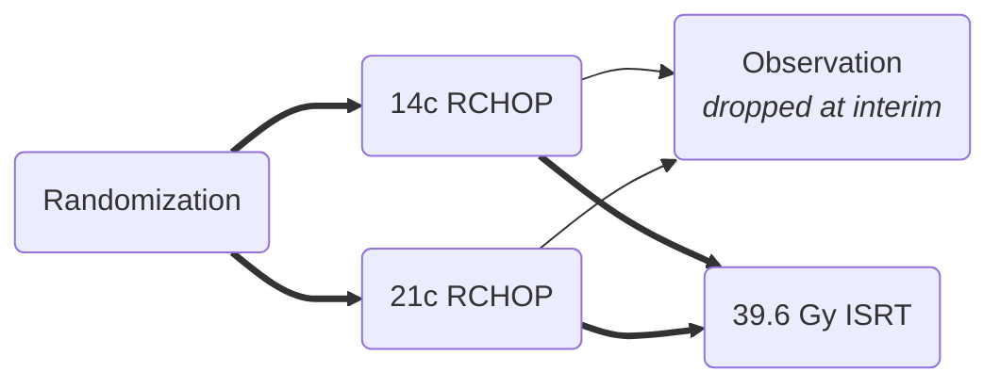

[moc::"[[]]"]
>[!title]
> UNFOLDER [Pfreundschuh ASCO '18](https://ascopubs.org/doi/10.1200/JCO.2018.36.15_suppl.7574), [Thurner Hemasphere '23](https://pubmed.ncbi.nlm.nih.gov/37427146/): 2x2

>[!intervention]
> R-CHOP{-21} vs. {-14} x6c {± 39.6 Gy ISRT to B (≥ 7.5 cm) and E} sites.

# Study
## 695 Patients
- Younger (18-60y; median 60).
- Early stage.
- aaIPI 0 and bulk ≥ 7.5 cm (57%) or aaIPI 1
- Extralymphatic involvement (one site: 47%, >1 site 16%).
- PMBCL 20%, DLBCL 80%
- MFU 5.5y

## Treatment
- if bulky and extranodal disease present, qualified for RT v Obs randomization
	- 2:1 RT to observation alone

# Results
## Response
- CR/CRu 79→ 90% 

## Survival
| 3y  | Chemo | RT  |
| --- | ----- | --- |
| EFS | 68    | 84  |
| PFS | 81    | 89  |
| OS  | 93    | 93  |
- EFS largely due to a high rate of PR (11→ 2%), triggering additional treatment (e.g. RT) as an EFS event

### PMBCL Subgroup (20%, n=136)
| 3y  | Chemo | RT  |
| --- | ----- | --- |
| EFS | 78    | 88  |
| PFS | 85    | 93  |
| OS  | 93    | 97  |

### DLBCL Subgroup
| 3y  | Chemo | RT  |
| --- | ----- | --- |
| EFS | 65    | 81  |
| PFS | 78    | 86  |
| OS  | 92    | 92  |

## Toxicity
- Radiotherapy-related acute G3-4 in around 1-3% of patients. 
- Secondary neoplasia ~7→ 3%.

>[!summary]
>- No-RT arms dropped at interim analysis due to inferior EFS for >7.5 cm or extralymphatic.
>- The addition of RT does help even in prolonged courses of R-CHOP (note: not PET-adapted therapy).
>- There is no difference in q14 vs. q21 R-CHOP
>^summary
