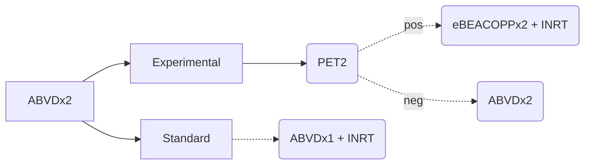

[moc::"[[]]"]
>[!title]
> EORTC LYSA GELA H10 F/U (2006-2011) [Raemaekers JCO '14](https://ascopubs.org/doi/full/10.1200/JCO.2013.51.9298), [André JCO '17](https://www.ncbi.nlm.nih.gov/pubmed/28291393), [Federico JCO '23](https://ascopubs.org/doi/full/10.1200/JCO.23.01745): 

>[!intervention] 
> All arms: ABVD→ PET2. In experimental arms, half of PET2(+) were escalated to BEACOPPesc x2→ 30 Gy INRT after initial ABVD x2c. 
> 	Favorable, PET2(-): ABVD x3c→ 30 Gy INRT (3c total) vs. ABVD x2→ ABVD x2 (4c total). 
> 	Unfavorable, PET2(-): ABVD x4c→ 30 Gy INRT (4c total) vs. ABVD x2→ ABVD x4 (6c total).

# study
- 1,925 I-II U/F pts. All patients got PET2 (even control arm). MFU 9.5y.
- PET2 negative = D1-2. D3+ considered positive. 
- RT: CTV for CRu = CC pre-chemo initial tumor mass, accounting for tumor shrinkage in axial direction. After 30 Gy, an additional 6 Gy boost to residual disease was allowed.
- This is INRT as in Europe, the Rad Onc is the Med Onc. So, they get the PET/CT in treatment position.
- PET2(-) achieved for U / F of 79→ 89%.
## Favorable

## Unfavorable

# results
- Interim analysis: 1y PFS for PET2(-) of 100→ 95% and 97→ 95% for F/U patients, respectively.
- For PET2(-) responders (81%): 
- 5y PFS for favorable disease of 99→ 87%.
- 10y PFS for favorable disease of 99→ 85% (HR 13.2). 
- 5y PFS for unfavorable disease of 92→ 90%.
- 10y PFS for unfavorable disease of 91→ 87%. 
- For PET2(+) responders (19%): 
- 5y PFS of 77→ 91%. 
- 10y PFS of ~79→ 85% (HR 0.67, 95CI 0.37-1.20). At 10y, the PFS difference with BEACOPPesc was no longer statistically significant.
- In the ABVD arm, relapses predominantly within involved nodes within two years of treatment. Of 24 relapses that occurred in the favorable group, 79% (n=19/24) involved previously involved nonirradiated lesions. Of 22 relapses that occurred in the unfavorable group, 91% (n=20/22) involved previously involved nonirradiated lesions.
- Late AE: There was no difference in cumulative rate of late AE between arms in both the F and U groups.

>[!summary] 
> See PET-Guided Therapy for Early-stage HL: Are we positive about a negative interim scan? [Bakst IJROBP '20](https://docs.google.com/document/d/1gKy2Hpx7FxInjOpKIBkTFJWpqhJ3I-gSXz9eRwq-NSY/edit#bookmark=id.on80n14yxoeb).
Noninferior, designed to demonstrate up to a 10% difference in FFTF in order to show omission of RT is acceptable.
Interim analysis demonstrated dropping RT leads to more early progressions. Study amended to give RT moving forward.
For both F and U groups, noninferiority of ABVD only could not be demonstrated. Risk of relapse was increased when INRT was omitted, especially in the favorable group.
Note: Favorable patients were likely over-treated on this trial, as ABVD x2c→ 20 Gy is standard per [HD 10](https://docs.google.com/document/d/1gKy2Hpx7FxInjOpKIBkTFJWpqhJ3I-gSXz9eRwq-NSY/edit#bookmark=id.x1kloo3nqbsq).
>^summary
