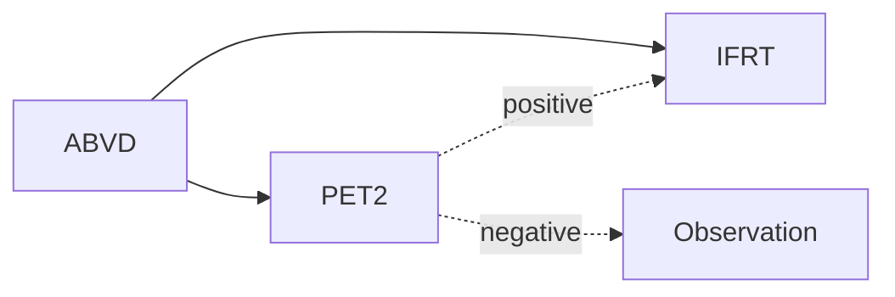

[moc::"[[]]"]
>[!title]
> GHSG HD16 (2009-2015) [Fuchs JCO '19](https://ascopubs.org/doi/abs/10.1200/JCO.19.00964): 

>[!intervention] 
> ABVD x2 → {IFRT 20 Gy} vs. {PET2(-) Obs/PET2(+) IFRT 20 Gy}.

# study
## 1150 patients
- Early stage 
- favorable HL similar to [GHSG HD10]. 
- MFU 4y.
- PET2(-) = Deauville 1-2. D3+ considered positive. 
	- PET2(-)/CR in around half

# results
## Control
- PET Negative
	- 5y PFS 94% with RT vs 87% without
- RT delivered
	- 5y PFS for 94% PET Neg. vs. 90% for PET Pos.
		- 84% for PET Pos. D4
- 5y In-field-failures 2.4→ 10.5%. 
	- Failures "in the neighborhood" of original sites appear to be driving the difference in PFS.
	- There were 15 failures (7 IFF) in the RT arm and 29 failures (26 in potential fields) in the observation arm.
- G3 toxicity 3.4%.
- SMN ~4.3→ 3.3%.

>[!summary] 
> - 2c ABVD and 20 Gy IFRT is the widely accepted standard of care for early stage favorable HL per [GHSG HD10], but many med oncs try to omit radiation based on PET/CT response. 
> 	- This shows there is a detriment in PFS when omitting radiation for PET2(-).
> - Most failures are "in the neighborhood" of the original sites of disease.
> - Utilizing D3+ as a PET(+) cutoff still demonstrates benefit with IFRT, though the difference is more pronounced with D4+.
> - PET-era trials showed PFS detriment when omitting RT in the setting of RER PET2on HD16 or PET3on [RAPID].
> - TBL: Among patients meeting GHSD-favorable criteria for Hodgkin lymphoma and a negative PET after 2 cycles of ABVD, the omission of radiation results in a significant decrease in disease control.
> - TBL: Consolidative 20 Gy involved-field radiation when a negative PET is achieved after ABVDx2 significantly decreases recurrences, predominantly local, with very few acute toxicities.
>^summary
