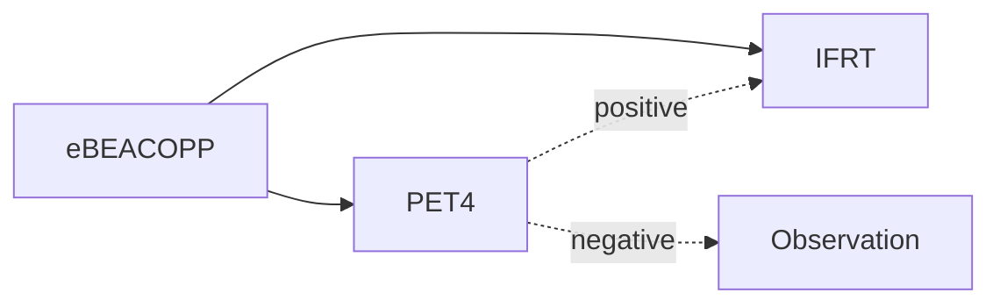

[moc::"[[]]"]
>[!title]
> GHSG HD17 (2012-2017) [Borchmann Lanc Onc '21](https://doi.org/10.1016/S1470-2045(20)30601-X):"2+2"

>[!intervention]
> 2+2 eBEACOPP → {IFRT 30 Gy} vs. {PET4(-) Obs. PET4(+) INRT 30 Gy}.

# Study
## 1100 Patients
- early stage (I-II)
- GHSG unfavorable
- MFU 4y.

## Treatment
- "2+2" BEACOPP/ABVD per [GSHG HD14].
- PET2 negative = D1-2. D3+ considered positive. 
- ==PET4(-) 67% (n=651)== 
- PET4(+): 
	- D3 (24%), 
	- D4 (9%).

# Results
- No benefit to RT if PET negative
	- 5y PFS ~97→ 95%. 
	- Sensitivity subgroup 5y PFS for control group / PET4(-) without RT group of ~98→ 96%. 
- Benefit of RT if PET +
	- 5y PFS for PET4 ± receiving RT of 98→ 94%. 
	- 5y PFS for PET4 D1-3 / D4 receiving RT of 98→ 82%. 
- 5y OS ~99→ 98%. 
- G3-4 Heme ~83%. Serious AE in ~30%.

>[!summary]
> - The majority of ES-unfavorable HL can be treated with 2+2 chemo alone. BEACOPP x2c followed by ABVD x2c is standard of care for early stage unfavorable HL per GHSG, but this is not widely used in the USA. Caution with PET-guided therapy and omission of RT when using ABVD alone (USA standard of care). Caution with interim PET scan (this study used final PET scan to guide therapy in the setting of BEACOPP, not interim as HD16). 
> - Utilize RT for D3+ PET, though the benefit of RT is more pronounced with D4+. 
> - TBL: Among patients with early stage, unfavorable HL who receive the GHSG 2+2 regimen, 2/3 of patients may safely omit additional radiation after a negative (Deauville 1-2) PET.
>^summary
