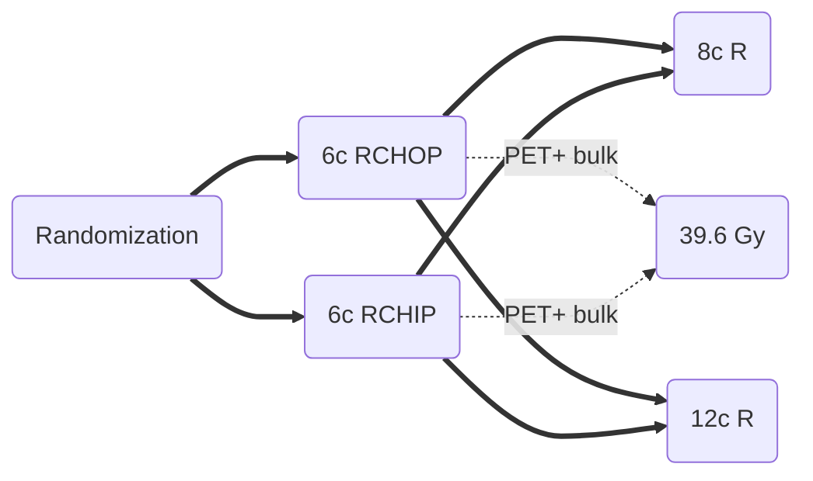

[moc::"[[]]"]
>[!title]
> OPTIMAL > 60 [Pfreundschuh ASCO '17](http://ascopubs.org/doi/abs/10.1200/JCO.2017.35.15_suppl.7506): 2x2.

>[!intervention] 
> R-CHOP vs. R-CHLIP (liposomal vincristine)

# study
## - 166 pts 
- bulk ≥ 7.5 cm, 
- 50% PET6+. 
- Older 61-80y. 
- 70% stage III/IV. 
## Treatment

- RT for PET6+ bulky ≥ 7.5 cm (n=80) to 39.6 Gy (78% actually received RT, n=62). 
- No RT for PET6bulky ≥ 7.5 cm.
- PET6(+) in 48% of bulky, 78% of these received RT. Compared to ~60% RT on RICOVER-60.

# results
- 4y PFS for PET6(+) no RT / PET6(+) RT / PET6(-) no RT of 35→ 70→ 80%.
- 2y PFS for bulky OPTIMAL > 60 / RICOVER-60 of 79→ 75%.
- 2y OS for bulky OPTIMAL > 60 / RICOVER-60 of 88→ 78%.

>[!summary] 
> There is a clear trend to 5% decreased PFS with the omission of RT to bulky disease which is PET(-) after chemo, and potential OS detriment. This difference was deemed non-inferior, indicating RT can be spared in PET(-) bulky disease, resulting in a 40% relative reduction in RT use as compared to RICOVER-60, which irradiated all initially bulky disease.
Small number of patients. 
Also see [RICOVER-noRTh](https://docs.google.com/document/d/1gKy2Hpx7FxInjOpKIBkTFJWpqhJ3I-gSXz9eRwq-NSY/edit#bookmark=id.amzolllp07ku)] (patients > 60y),  [[UNFOLDER](https://docs.google.com/document/d/1gKy2Hpx7FxInjOpKIBkTFJWpqhJ3I-gSXz9eRwq-NSY/edit#bookmark=kix.jygmd2npyuiv) (patients 18-60) which demonstrated EFS detriment with omission of RT to CT-based residual of initially bulky disease.�
>^summary
